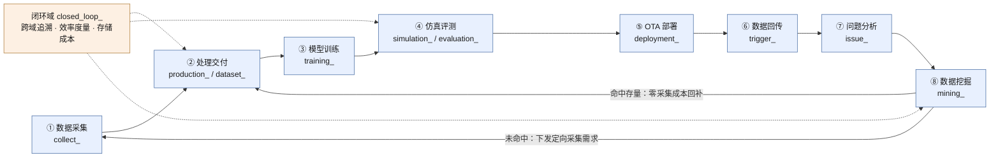
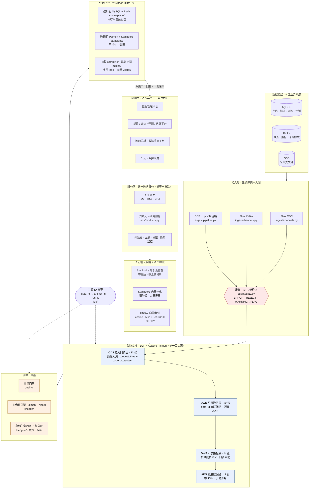

# 智驾数据闭环湖仓（adas-closed-loop-lakehouse）

> **8 环节闭环 × 11 数据域 × 88 张 Paimon 表 × 11 个子系统**
>
> 一套可运行、可校验、可导出 DDL 的智驾数据闭环湖仓参考实现。

一辆高阶智驾车每天产生 TB 级多传感器数据，一个量产车队很快冲上 PB 级。但决定产品
竞争力的不是囤了多少数据，而是**数据闭环转得快不快**。闭环要转起来，就必须有一个统一
底座接住全链路数据——本项目就是这个底座的完整工程化实现。

本项目是对公众号「小周谈智驾数据闭环」系列 15 篇 + Paimon 官方 1 篇、共
**16 篇文章**的工程化复现，清单见 [`docs/articles.md`](docs/articles.md)。

## 它是什么 / 它不是什么

**是**：

- 一份**可执行的表契约**——88 张表的分层、数据域、主键、分区、bucket、changelog-producer
  全部落成代码，`TableSpec` 在建表期硬校验，一条命令渲染出四层建表 SQL；
- 一套**11 个子系统的参考实现**——入湖门禁、血缘双引擎、向量检索、生命周期治理、
  抽帧、规则挖掘、标签治理、挖掘平台控制面/数据面……共 47,703 行、2,175 个 `def`/`class`；
- 一份**诚实的偏差账本**——原文口径冲突之处逐条登记选边理由，原文未明确之处
  逐处标注为本项目设计，见 [`docs/source-deviations.md`](docs/source-deviations.md)。

**不是**：

- **不是原文作者的真实 DDL**。原文只公开了表名与语义，88 张表的字段定义**全部是本项目
  推断**（`fields_inferred=True`，88/88）。要拿到作者的完整设计文档，请向原公众号索取；
- 不是生产就绪系统。离线部分（契约校验、DDL 渲染、ID 体系）零依赖可跑，
  连接真实 Flink / StarRocks / Neo4j 的部分需要自行补齐驱动与集群。

---

## 架构

### 8 环节闭环



两条硬约束：**仿真评测必须先于 OTA 部署，问题分析必须后于数据回传**。
挖掘域是闭环的「变速箱」——双出口决定每一圈循环的成本与速度。

### 四层湖仓 + 全栈组件



> 数据流自上而下沉淀，服务流自下而上供给；**应用层不碰存储引擎**——底层引擎换了，
> 上层应用无感。完整设计说明见 [`docs/architecture.md`](docs/architecture.md)。

---

## 快速开始

### 前置

Python **3.11+**。离线部分（契约校验 / DDL 渲染 / ID 演示）**零第三方运行时依赖**，
裸环境即可跑通；只有起本地依赖栈才需要 Docker。

```bash
cd apps/adas-closed-loop-lakehouse
make install-dev          # 可编辑安装 + pytest / ruff / mypy
```

未安装也能直接跑，把 `src/` 加到 `PYTHONPATH` 即可：

```bash
PYTHONPATH=src python3 -m adas_lakehouse.cli --help
```

### 30 秒验证

```bash
make validate     # 88 张表硬校验 + 命名偏离审计（有违规则非零退出，可当 CI 断言）
make stats        # 数据域 × 层级 表数统计，并与原文口径逐层对账
make ddl          # 渲染 00_catalog + 10_ods / 20_dwd / 30_dws / 40_ads 到 ddl/
make test         # pytest
```

`make validate` 的预期输出：

```
[1/2] 硬校验 registry.validate_all()：88 张表
  ✅ 0 违规（命名 / 主键 / 分区含主键 / bucket 五档 / changelog 分层 全通过）
[2/2] 命名偏离审计（naming.lint，非阻断；四段式完全合规 41/88 张）
...
结论：硬违规 0 处；命名偏离 27 处（已登记 27，未登记 0）
```

那 27 处偏离**不是 bug**——是原文表名不符合原文自己提出的命名公式，本项目选择不改表名、
逐张登记。详见 [`docs/source-deviations.md`](docs/source-deviations.md)。

### CLI

```bash
adas-lakehouse ddl-export                 # 导出四层建表脚本到 ddl/
adas-lakehouse ddl-export --layer dwd     # 只导 DWD 层
adas-lakehouse catalog-validate --list    # 校验并列出全部偏离表名
adas-lakehouse catalog-stats              # 数据域 × 层级统计 + 原文对账
adas-lakehouse id-demo --vehicle BP       # 三级 ID 生成 / 派生 / 反解演示
```

### 本地依赖栈（可选，需要 Docker）

```bash
cp .env.example .env           # 每一项默认值都等于代码里的默认值，可直接原样用
make up                        # MinIO / MySQL / Kafka / Flink / StarRocks / Neo4j / Redis
make logs SERVICES=jobmanager
make down                      # 停止并清理容器（保留数据卷）
```

`.env.example` 列出了**代码里所有会读的环境变量**；栈的组成与排障见
[`docker/README.md`](docker/README.md)。

#### 端口对照表

本栈**独占宿主机 186xx 号段**，与同仓平台（`./platform.sh up-full`）互不冲突，
两者可同时运行，无需手工改任何端口。

| 服务 | 容器端口 | 宿主机端口 | 用途 |
|---|---:|---:|---|
| MinIO S3 API | 9000 | **18600** | S3 协议，Paimon 仓库根 |
| MinIO Console | 9001 | **18601** | 浏览器管理台 |
| MySQL | 3306 | **18606** | CDC 源库 + 控制面库 |
| StarRocks 查询 | 9030 | **18630** | MySQL 协议查询口 |
| StarRocks FE HTTP | 8030 | **18631** | FE Web UI / REST |
| StarRocks BE HTTP | 8040 | **18640** | Stream Load 入口 |
| Neo4j Browser | 7474 | **18674** | 血缘图库 Web UI |
| Neo4j Bolt | 7687 | **18687** | Bolt 协议 |
| Redis | 6379 | **18679** | 控制面状态 |
| Flink Web UI | 8081 | **18681** | JobManager REST / Web UI |
| Flink SQL Gateway | 8083 | **18683** | SQL Gateway REST |
| Kafka | 9092 | **18692** | 宿主机侧 bootstrap |

规则是 `186` + 容器端口末两位（`8030` 的 `30` 被 `9030` 占了，顺延为 `18631`）。
**只有宿主机发布端口变了，容器端口一律不动**——compose 网络内部仍然是
`minio:9000`、`kafka:29092`、`mysql:3306`、`bolt://neo4j:7687`。
号段选型理由与逐条改法见 [`docs/ports.md`](docs/ports.md)。

起栈后的访问入口：

```bash
open http://localhost:18681            # Flink Web UI（作业 / Checkpoint / TaskManager）
open http://localhost:18601            # MinIO Console
open http://localhost:18674            # Neo4j Browser（血缘图）
open http://localhost:18631            # StarRocks FE HTTP
curl -sf http://localhost:18683/v1/info   # Flink SQL Gateway 健康检查

mysql -h 127.0.0.1 -P 18630 -u root                # StarRocks 查询口
mysql -h 127.0.0.1 -P 18606 -u adas -p             # CDC 源库 / 控制面库
redis-cli -p 18679 ping                            # 控制面状态
```

起栈后可把 `ddl/*.sql` 与 `flink/sql/*.sql` 依次执行，顺序为
`00_catalog.sql` → `10_ods` → `20_dwd` → `30_dws` → `40_ads` → 各 `starrocks_*.sql`。

### 全量检查

```bash
make check        # validate + lint + fmt-check + test
```

---

## 目录结构

```
adas-closed-loop-lakehouse/
├── README.md                    本文件
├── pyproject.toml               包定义（运行时零第三方依赖；可选分组按实际 import 归类）
├── Makefile                     工程入口：up/down/ddl/validate/stats/test/lint/check
├── .env.example                 代码里所有会读的环境变量，值 = 代码默认值
│
├── src/adas_lakehouse/          133 个模块 · 47,703 行
│   ├── cli.py                   命令行入口（ddl-export / catalog-validate / catalog-stats / id-demo）
│   ├── config.py                全栈连接配置（Paimon / StarRocks / Neo4j / Kafka / OSS / MySQL / Redis）
│   ├── domains.py               ★ 11 数据域 + 四层 Layer + 系统字段规范
│   ├── naming.py                ★ 四段式命名公式：parse / lint / 13 种粒度后缀 / 域别名
│   ├── ids/                     ★ 三级 ID：data_id → artifact_id → run_id，含反解
│   ├── catalog/
│   │   ├── spec.py              ★ TableSpec：分区/bucket/changelog/主键 建表期硬校验
│   │   ├── registry.py          ★ 88 张表聚合 + validate_all()
│   │   └── tables/_*.py         12 个模块，每数据域一个（+ 质量门禁伪域）
│   │
│   ├── ingest/                  三通道入湖 + 五步合规链路
│   ├── quality/                 质量门禁：六维检查 + 五步异常闭环
│   ├── lineage/                 血缘双引擎：Paimon 管事实 + Neo4j 管关系
│   ├── vector/                  HNSW 向量索引 + Embedding 流水线 + VARIANT
│   ├── lifecycle/               存储生命周期五级分层 + 日级调度闭环
│   ├── tags/                    统一标签体系：三源收口 + 四态治理
│   ├── sampling/                分层抽帧：三道成本闸门
│   ├── mining/                  规则挖掘引擎：六大种类 + 批流双模
│   ├── controlplane/            挖掘平台控制面：编排 / 下发 / 状态 / OpenAPI
│   ├── dataplane/               挖掘平台数据面：引擎接入 / 执行 / GPU 分时 / 查询
│   └── ads/                     11 张 ADS 数据产品 + 统一 API 网关 + 双路选路
│
├── ddl/                         建表脚本（3,921 行）
│   ├── 00_catalog.sql           Paimon Catalog 与 database 初始化
│   ├── 10_ods.sql / 20_dwd.sql / 30_dws.sql / 40_ads.sql    ← 由 `make ddl` 渲染，勿手改
│   └── starrocks_*.sql          StarRocks 侧：ingest / lineage / vector / lifecycle / sampling
│
├── flink/sql/                   20 个 Flink SQL 作业（2,477 行）
├── scripts/export_ddl.py        DDL 渲染脚本（`make ddl` 调用）
├── docker/                      本地依赖栈
│   ├── compose.yaml             MinIO / MySQL / Kafka / Flink / StarRocks / Neo4j / Redis
│   ├── README.md                栈的组成、端口与排障
│   └── {flink,starrocks,neo4j,kafka,mysql,minio}/   各组件配置与初始化脚本
├── tests/                       pytest 用例
└── docs/
    ├── architecture.md          ★ 架构设计说明，逐节注明来源文章
    ├── source-deviations.md     ★ 源文偏差登记（诚信底线，必读）
    ├── ports.md                 宿主机 186xx 端口规划：号段选型 + 容器端口不变原则
    └── articles.md              16 篇原文清单 + 逐篇对应实现模块
```

---

## 子系统一览

| 子系统 | 做什么 | 对应文章 | 入口模块 | 行数 |
|---|---|---|---|---:|
| `catalog/` | 88 张表的契约与硬校验，渲染四层 DDL | [a10] [a12] | `registry.py` · `spec.py` | 3,404 |
| `ingest/` | 三通道入湖（CDC / Kafka / OSS）+ 五步合规链路 + 双脱敏 | [a8] [a5]⑥ | `pipeline.py` · `channels.py` | 4,405 |
| `quality/` | 六维检查框架 + 三分支处置 + 五步异常闭环 + YAML 规则引擎 | [a6] | `gate.py` · `closed_loop.py` | 5,280 |
| `lineage/` | 三级血缘模型 + 双链路写入 + 四个查询方向（图库找关系、湖仓取明细） | [a13] [a11] | `query.py` · `graph.py` | 3,827 |
| `vector/` | 向量落湖 + StarRocks 外部表 HNSW + Embedding 五步流水线 + VARIANT | [a7] [a9] | `search.py` · `index.py` | 3,964 |
| `lifecycle/` | 五级分层（热/温/冷/归档/删除）+ 元信息驱动 + 日级调度闭环 | [a14] | `scheduler.py` · `tiers.py` | 3,741 |
| `tags/` | 五大类别受控词表 + 三源收口管道 + 四态生命周期（防标签爆炸） | [a2] | `pipeline.py` · `dictionary.py` | 4,078 |
| `sampling/` | 三道成本闸门：常规抽帧 / 事件抽帧 / 推理抽帧 | [a3] | `engine.py` · `gates.py` | 2,883 |
| `mining/` | 六大规则种类 + 批流双模 + 场景缺口分析 + 规则配置即湖仓资产 | [a1] | `executor.py` · `rules.py` | 5,813 |
| `controlplane/` | 挖掘平台控制面：任务编排 / 规则下发 / 状态管理 / OpenAPI | [a4] | `scheduler.py` · `contracts.py` | 3,638 |
| `dataplane/` | 挖掘平台数据面：引擎接入 / 执行 / GPU 分时复用 / 双路查询 | [a4] | `execution.py` · `gpu.py` | 1,660 |
| `ads/` | 11 张 ADS 表 × 六主题 × 六平台 + 统一 API 网关 + 内表物化 | [a15] [a5]⑨ | `products.py` · `gateway.py` | 3,809 |
| `ids/` | 三级 ID 生成 / 派生 / 反解 | [a11] | `__init__.py` | 189 |
| | | | **合计（含顶层模块）** | **47,703** |

文章编号对照见 [`docs/articles.md`](docs/articles.md)。行数为 `find src -name '*.py' | xargs wc -l`
口径，随代码演进会变。

---

## 湖仓表一览

| 层级 | 表数 | 职责 |
|---|---:|---|
| ODS | 33 | 原样入湖，与数据源一一对应；大文件外置只存路径与元信息 |
| DWD | 30 | 以 `data_id` 串联闭环链路，跨源 JOIN 与标准化 |
| DWS | 14 | 按业务维度预聚合，口径固化 |
| ADS | 11 | 零 JOIN，开箱即用 |
| **合计** | **88** | = 11 数据域 87 张 + 质量门禁伪域 1 张 |

物理策略（全部由 `catalog/spec.py` 硬校验）：**6 张分区表**、**Bucket 五档 `{1,2,4,8,16}`**、
**changelog-producer 严格按层**（ODS `input` / DWD `lookup` / DWS·ADS `full-compaction`）、
**分区表主键必须含分区字段**。

`make stats` 可打印「数据域 × 层级」完整统计并与原文口径逐层对账。

---

## 诚信声明

原文是架构设计文章，不是设计文档。本项目对此的处理是**全部摊开写明**，而不是默默填空：

| 情况 | 规模 | 登记位置 |
|---|---|---|
| 原文口径自相矛盾、本项目选边 | 9 类（表数量 / bucket 上限 / 分区张数 / 命名规范 / 后缀数量 …） | [`docs/source-deviations.md` A 部分](docs/source-deviations.md) |
| 原文未明确、本项目自行设计 | **302 处**，代码中逐处标注 `⚠️ 原文未明确，本项目设计：` | [`docs/source-deviations.md` B 部分](docs/source-deviations.md) |
| 字段定义为本项目推断 | **88 / 88 张表**（`fields_inferred=True`） | [`docs/source-deviations.md` A-8](docs/source-deviations.md) |

自行复核：

```bash
make validate      # 命名偏离 27 处，已登记 27，未登记 0；硬违规 0
make stats         # 表数对账
grep -rn "原文未明确" --include="*.py" src/ | grep -v '/cli\.py:' | wc -l   # → 302
```

**如果命令输出与文档不符，以命令输出为准，并请更新文档。**

---

## 相关文档

- [`docs/architecture.md`](docs/architecture.md) — 四层建模 / 11 数据域 / 三级 ID /
  质量门禁 / 血缘双引擎 / 双路查询 / 存储生命周期 / 控制面数据面分离，逐节注明来源文章
- [`docs/source-deviations.md`](docs/source-deviations.md) — 源文偏差登记
- [`docs/ports.md`](docs/ports.md) — 宿主机 186xx 端口规划：对照表、号段选型理由、
  「容器端口不变、只改宿主机发布端口」原则与逐条改法
- [`docs/articles.md`](docs/articles.md) — 16 篇原文清单与逐篇对应实现
