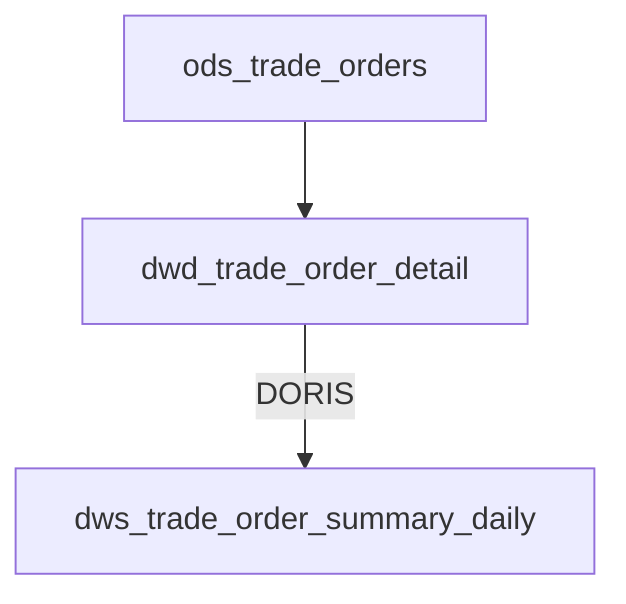

# 数据模型总览索引

## 数据流向图 (Mermaid)

```mermaid
graph TD
    ODS[ods_trade_orders] --> DWD_Order[dwd_trade_order_detail]
    DWD_Order -->|DORIS| DWS_Summary[dws_trade_order_summary_daily]
```

## 数据表清单
- [DWS 层级] [dws_trade_order_summary_daily 数据模型文档](file:///Users/mindezhi/DataWareHouse-Agent/docs/data-model/dw_store.dws_trade_order_summary_daily.md)
